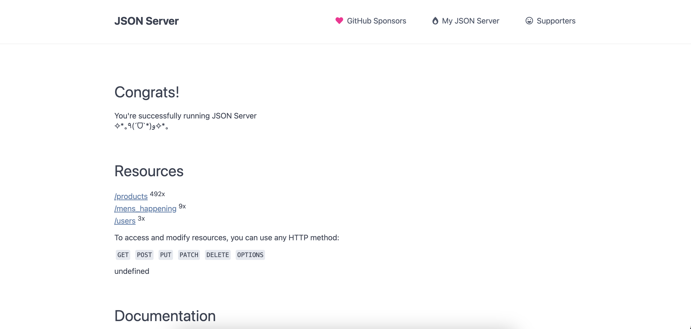

## This repository is for construction week project for course JS201 batch ft30.

### Team Name :- loop-illusionist-8901

### Team members :-

1- Aamir Mir ft30_165

2- Pranoti Kadam

3- Vibha Mauriya

4- Himanshu Jaiswal

5- Madhu Mishra

## This repo has two Parts.

## 1- Backend Server

### Objectives :-

- Create a JSON web server for backend API's.

- Ensure Deployment.

- Implement Auth using JWT.

- Deployment https://loop-illusionist-8901.onrender.com

## 2-Frontend

### Objectives :-

- Create a look-a-like landing page from https://www.fwrd.com/ .

- Use HTML/CSS?VANILA_JS to achieve the design.

- Implement appropraite animations and effects.

- Implement Login/Signup with Authentication functionality.

- Implement Cart and Wishlist functionality.

- Implement Admin Authrization functionality.

- Project tracker https://github.com/users/Koshur1504/projects/7/views/7

 
 
 

# Before staring to code, Please go through the notion doc below to understand how branching is going to work.

## How to clone the repo

## **Ensure you are using node version 21.6.2**

## **Ensure you are formatting the code before commiting**

1- **Open any drive or folder with VS code**

2- **Clone using**
`git clone https://github.com/Koshur1504/loop-illusionist-8901`

3- `cd /loop-illusionist-8901`

4- `code .`

5- To install dependencies navigate to the root folder then use
`npm run install_things`

6- To start backend_Server run the command in separate terminal 
`npm run start_be`

7- To start frontend run the command in separate terminal 
`npm run start_fe`

# Important

1- Our main branch is 'main'. But you have to push code to your own branch. So Push code accordingly.

2- Notion doc for all refrences https://masai-school.notion.site/MSI-CW-Block-32-a071009400574da9ade2b66b48f3d2db

3- Follow this spredsheet for issue refrence, issues are already created for each member, however everyone must add tasks to the issue before starting anywork. https://docs.google.com/spreadsheets/d/1DJTnpq5ETUKeFcRnpGoBph_mUSF783868Zy4hS_L8Fs/edit#gid=0

4- Use Kanban to update issues and todo list.

5- Check tasks after completing the task.

# Most importantly

## In case of fire

### 1 - `git add .`

### 2 - `git commit`

### 3 - `git push`
